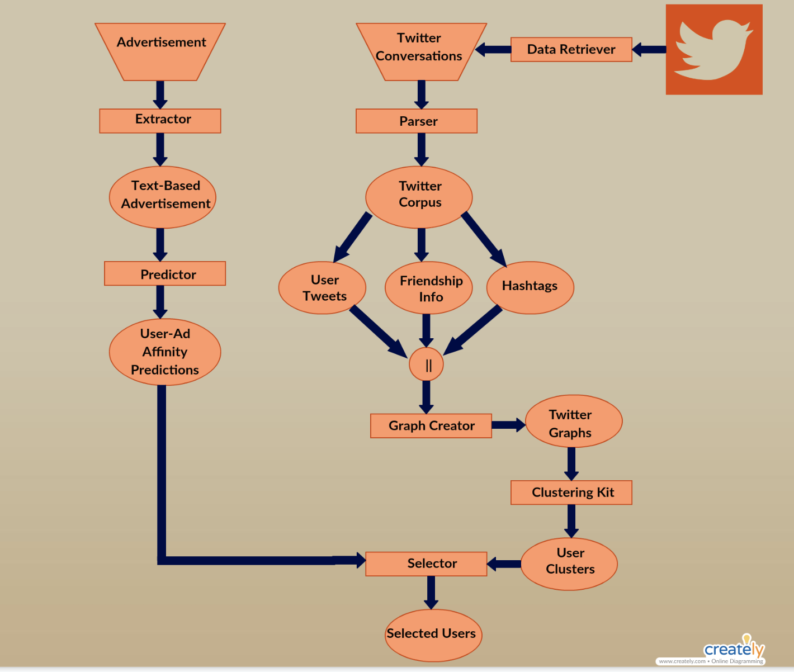

# TwitterDataAnalysisForAds

* Twitter4J to fetch tweets posted from Ankara/Turkey location. 

* Choosing Text-based advertisement and find similarities between this advertisement and users.

* Finding users(target group) that are interested in this advertisement.

* Dividing target group in connected people clusters. 

* Assuming that when I send advertisement to a person in each cluster, the others can see this advertisement from their cluster members.

* Agglomerative Clustering algorithm to cluster target users and Cosine Similarity algorithm to find user similarities between user to user and user to advertisement.  

-> Friendship Graphs

-> Cosine Similarity analysis between user to user & user to advertisement

-> User Dendogram

